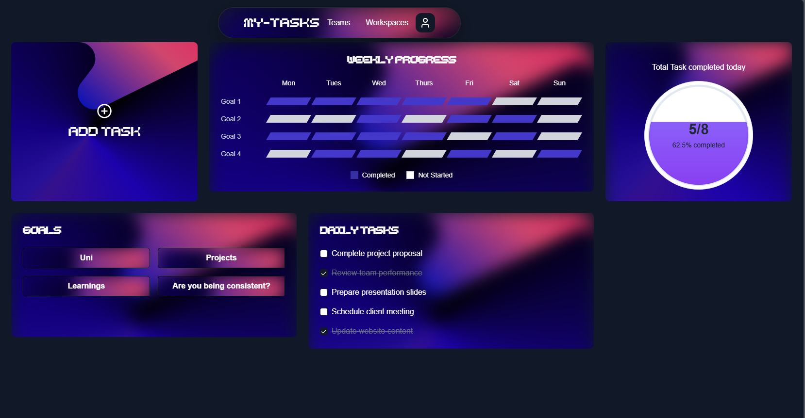

# My-Tasks 🚀

[](https://opensource.org/licenses/MIT)


The ultimate productivity companion for modern task management and goal achievement.



## 🌟 Features

### Core Features
- 📝 **Smart Task Management**
  - Create & organize daily/weekly tasks
  - Priority tagging & due date reminders
  - One-click task completion
  - Progress streak tracking

- 📊 **Insightful Analytics**
  - Visual progress dashboard
  - Completion rate statistics
  - Monthly/weekly breakdowns
  - Achievement streaks calendar

- 🗺️ **Task Mapping**
  - Visual task roadmapping
  - Drag-and-drop organization
  - Task dependency linking
  - Project milestone tracking

### Advanced Capabilities
- 🔔 Smart reminders & notifications
- 📈 Productivity trend analysis
- 🎯 Goal-oriented task grouping
- 🌓 Dark/Light mode support
- 🔄 Cross-device sync

## 🚀 Getting Started

```bash
# Clone repository
git clone https://github.com/Kongkon06/My-taskv2.git

# Install dependencies
cd my-tasks
npm install

# Start development server
npm run dev
```

[](https://my-tasks.app)

## 📸 App Preview

| Task List View | Analytics Dashboard | Task Mapping |
|----------------|---------------------|--------------|
|  |  |  |

## 📚 Documentation

### Key Components
- `TaskManager.ts`: Core task operations
- `AnalyticsEngine/`: Progress tracking system
- `TaskMap/`: Visual mapping module
- `StreakCounter.tsx`: Motivation system

### Architecture
```plaintext
src/
├── components/  # UI Components
├── screens/     # App Views
├── utils/       # Helper Functions
├── types/       # TypeScript Definitions
└── assets/      # Media Resources
```

## 🤝 Contributing

We welcome contributions! Please follow these steps:
1. Fork the repository
2. Create your feature branch (`git checkout -b feature/AmazingFeature`)
3. Commit your changes (`git commit -m 'Add some AmazingFeature'`)
4. Push to the branch (`git push origin feature/AmazingFeature`)
5. Open a Pull Request

## 📜 License

Distributed under the MIT License. See `LICENSE` for more information.

## ✉️ Contact

Project Maintainer: Kongkon Bora - contact@kbora3525@gamil.com 
Project Link: [https://github.com/your-username/my-tasks](https://my-taskv2.vercel.app/)

---

## 🛠️ Tech Stack

- **Frontend**: React Native, TypeScript, Expo
- **State Management**: Redux Toolkit
- **Charts**: Victory Native
- **Navigation**: React Navigation
- **Styling**: Styled Components

## 🌈 Roadmap

- [x] Phase 1: Core Task Management (Q1 2024)
- [ ] Phase 2: Advanced Analytics (Q2 2024)
- [ ] Phase 3: Team Collaboration (Q3 2024)
- [ ] Phase 4: AI-Powered Suggestions (Q4 2024)

---

**Transform your productivity today!** 🌟  
*"Organize Your World, Achieve Your Goals"* ✨
```
3. Add real screenshots
4. Update contact information
5. Customize the roadmap and tech stack details

Would you like me to create specific technical documentation for any of the components or help with installation/setup instructions?
